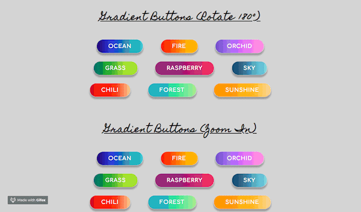
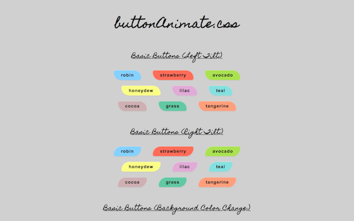

# About buttonAnimate.css
**buttonAnimate.css** is a CSS library for ready-to-use animated buttons.  There are your basic buttons in three different varieties: left tilt and right tilt buttons, as well as color changing buttons.  And there are your gradient buttons in three options: zoom-in animated buttons, 180° rotating buttons and 360° rotating buttons.

## Button Demos
### Click on images to view demos
*Basic Buttons*  
  
*Gradient Buttons*  

## Instructions to Use
**To use any of these button styles on your own webpage:**
1. Make sure to include the following external stylesheet between the `<head>` and `</head>` tags in your html file:  
   
`<link rel="stylesheet" href="https://s3.amazonaws.com/button-animate-css/style.css">`  
  
2. To choose a particular button, first find the class for the style you want to use:

Type of Button | Class Name
------------ | -------------
Basic Button - Left Tilt | left-tilt
Basic Button - Right Tilt | right-tilt
Basic Button - Color Change | change-color
Gradient Button - Rotate 180° | gradient-button
Gradient Button - Zoom-In | zoom-button
Gradient Button - Rotate 360° | rotate-button  
  

3. Once you found the class for the style of button you desire, find the class for the color you want to use (go by the color written in the button):

Color for Basic Button | Class Name
------------ | -------------
Robin | color-robin
Strawberry | color-strawberry
Avocado | color-avocado
Honeydew | color-honeydew
Lilac | color-lilac
Teal | color-teal
Cocoa | color-cocoa
Grass | color-grass
Tangerine | color-tangerine  
  

Color for Gradient Button | Class Name
------------ | -------------
Ocean | color-ocean
Fire | color-fire
Orchid | color-orchid
Grass | color-grass
Raspberry | color-raspberry
Sky | color-sky
Chili | color-chili
Forest | color-forest
Sunshine | color-sunshine  
  

4. Now that you've noted the class name for both the style of button and color of button you want to use, plug them into the code for your button like so:

`<button class="rotate-button color-fire">FIRE</button>`  
  
In the example above, the "Gradient Button - Rotate 360°" (class: rotate-button) in the Fire color (class: color-fire) was used.
  
`<button class="right-tilt color-teal">teal</button>`  
  
In this second example, the "Basic Button - Right Tilt" (class: right-tilt) in the Teal color (class: color-teal) was used.

If you followed the steps above, you are now ready to use your animated buttons!

## Landing Page

[Click to visit the landing page:](https://natgonzalezrosa.github.io/buttonAnimate.css/)